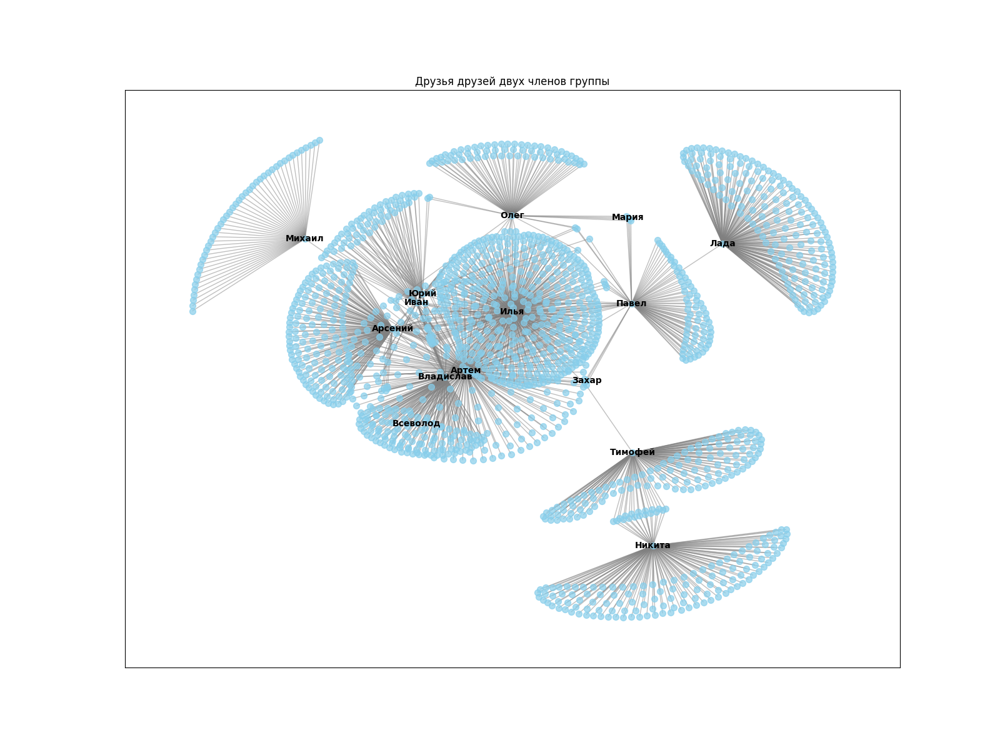
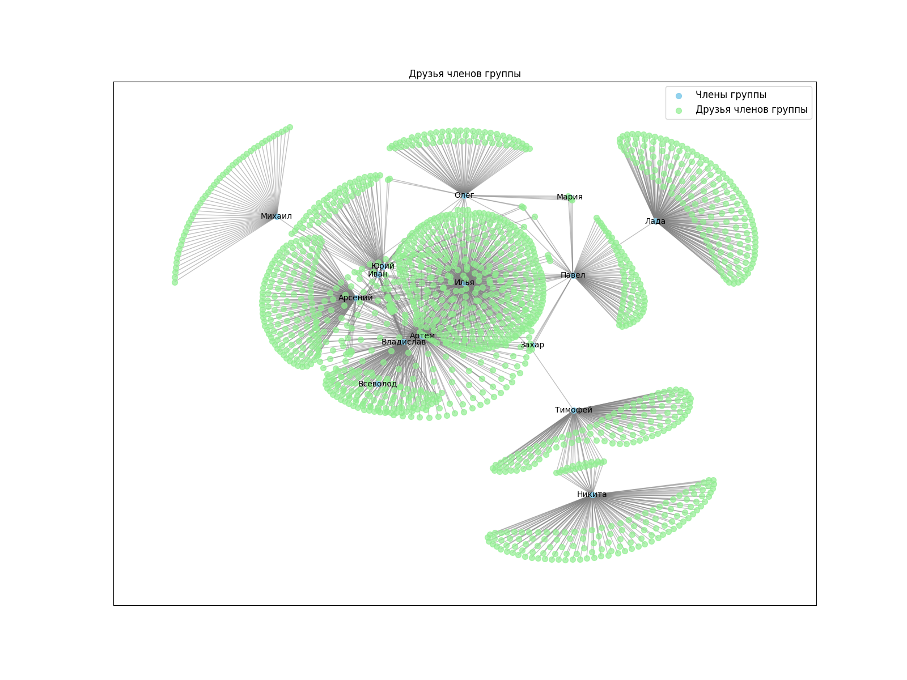

# Лабораторная 1 по курсу "Технологии искусственного интеллекта"

> Обозначения:
> - `foc - friends of colleagues`
> - `fofoc - friends of friends of colleagues`

Задача:
1) Собрать информацию о друзьях и друзьях друзей из VK для членов группы `М8О-208М-23`
2) Оценить центральность: по посредничеству, по близости, собственного вектора (для членов группы `М8О-208М-23`)

## Предварительные требования
- получить access token для `vk.com` по [ссылке](https://vkhost.github.io/)
- создать файл `.env` с переменной `VK_TOKEN`, в которую положить раннее полученный access token

## Граф друзей друзей двух членов группы

## Граф друзей членов группы

## Оценка центральности

## Бригада
- Каримов Аскар
- Михаил Леонов
